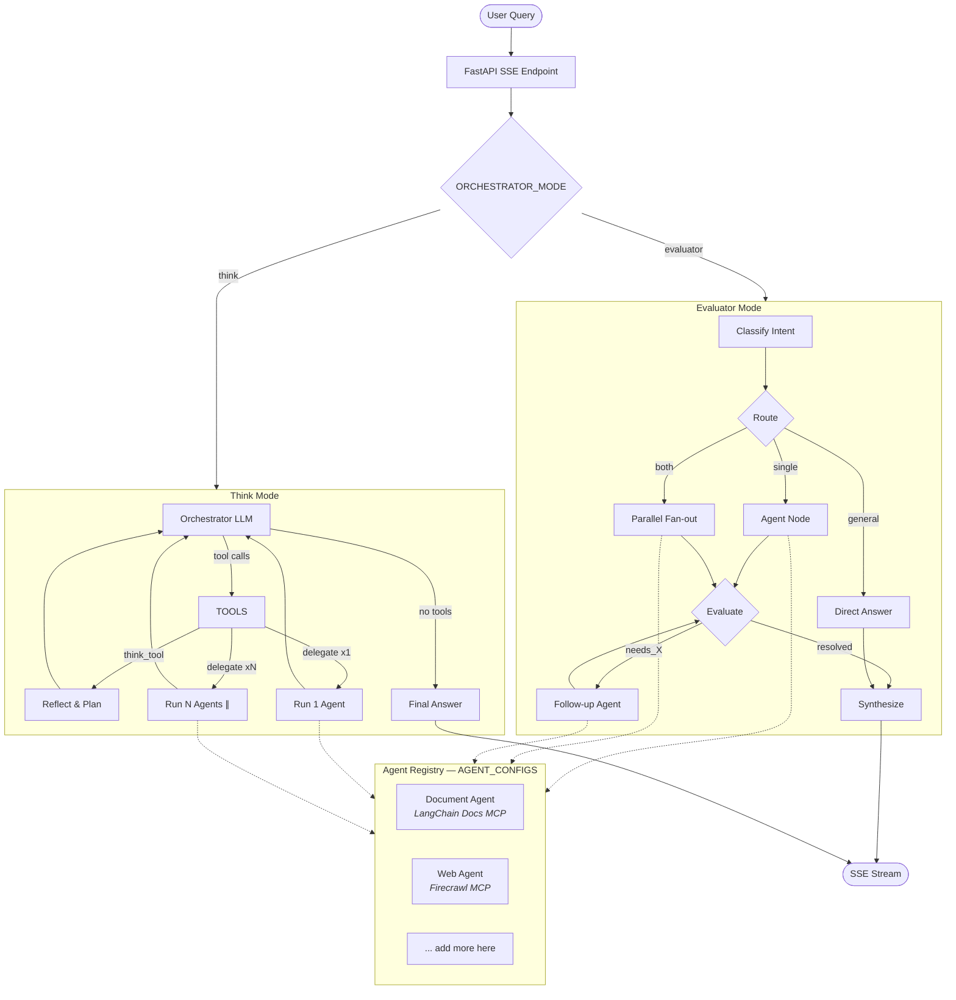
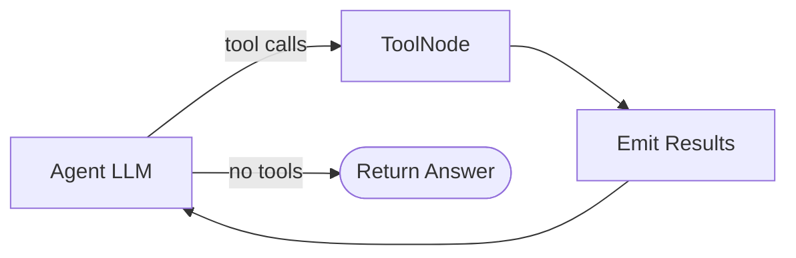

# LangGraph Multi-Agent Streaming

Registry-driven multi-agent orchestrator with FastAPI SSE streaming, two switchable orchestration strategies, and optional MLflow tracing.

## Architecture



## Sub-Agent ReAct Loop

Each sub-agent is an identical ReAct graph with its own MCP tools:



## Orchestrator Modes

| | Evaluator | Think |
|---|---|---|
| **Decision maker** | Separate classifier + evaluator LLMs | Single orchestrator LLM |
| **Parallel** | `asyncio.gather` over all agents | Multiple `delegate()` calls in one response |
| **Escalation** | Evaluator returns `needs_X` → follow-up loop | LLM calls `think_tool` → decides to delegate again |
| **Graph nodes** | ~10 (scales with agents) | 4 (fixed) |
| **Switch** | `ORCHESTRATOR_MODE=evaluator` | `ORCHESTRATOR_MODE=think` |

## Adding a New Agent

Add one entry to `AGENT_CONFIGS` in `app/agent.py`:

```python
{
    "name": "k8s_agent",
    "role": "Kubernetes specialist",
    "description": "Troubleshoot pods, deployments, services...",
    "system_prompt": "You are a Kubernetes expert...",
    "mcp_server": "k8s_mcp",
    "tool_prefix": "k8s",
    "evaluator_intent": "kubernetes",
}
```

Both modes auto-discover it. No other code changes needed.

## Setup

```bash
cp .env.example .env
# Fill in FIRECRAWL_API_KEY and GOOGLE_API_KEY

uv sync
python main.py
# or: uvicorn app.app:app --host 0.0.0.0 --port 8000
```

Open `http://localhost:8000/agent/copilot` for the chat UI.

## Configuration

| Variable | Default | Description |
|---|---|---|
| `ORCHESTRATOR_MODE` | `evaluator` | `evaluator` or `think` |
| `GEMINI_MODEL` | `gemini-2.5-flash` | Gemini model name |
| `MAX_AGENT_STEPS` | `25` | LangGraph recursion limit |
| `MAX_RESOLUTION_ROUNDS` | `2` | Max evaluate→follow-up loops |
| `MLFLOW_ENABLED` | `false` | Enable MLflow tracing |
| `MLFLOW_TRACKING_URI` | `http://localhost:5050` | MLflow server URL |

## SSE Event Protocol

```
{"type": "agent_start",  "agent": "...", "role": "..."}
{"type": "handoff",      "from": "...", "to": "...", "reason": "..."}
{"type": "tool_call",    "name": "...", "args": {...}}
{"type": "tool_result",  "name": "...", "content": "..."}
{"type": "text",         "content": "..."}
{"type": "done"}
```

## Project Structure

```
main.py           — uvicorn entrypoint
app/
  __init__.py     — package marker
  app.py          — FastAPI app, routes, CORS, middleware, static files
  agent.py        — orchestrator + sub-agents + registry + SSE streaming
  settings.py     — centralised config (pydantic-settings)
  tracing.py      — MLflow integration (conditional on MLFLOW_ENABLED)
static/           — chat UI (index.html, styles.css, app.js)
pyproject.toml    — project metadata & dependencies
```
